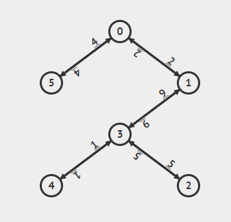

# DistAlgo APSP
This is a "h" hops "k" sources shortest path algorithm in distributed computing.
## Model

The basic model is a **no failure, synchronous**, Message Passing model. The message queue for each process is **FIFO**. The details of this model are:

- h is the maximum number of hops
- k is the number of sources (*k < n*)
- The input is an directed graph without **Zero Weight** and **Zero Cycle**.


## Useage
#### Input:

**The graph G:** All values weight of edges using ajacency matrix description. We use negative number to stand for infinite value.
Δ is the expected number of largest shorest path. It could make the algorithm terminate earlier if you provide a proper value. Here is the example of input.
``` python
weights = [
    -1, 2, -1, -1, -1, 4,
    2, -1, -1, 6, -1, -1,
    -1, -1, -1, 5, -1, -1,
    -1, 6, 5, -1, 1, -1,
    -1, -1, -1, 1, -1, -1,
    4, -1, -1, -1, -1, -1
]
delta = 10
hop = 10
r_max = 30
# ps[i] means use the process whose vertex index is i to be the source.
sources = [ps[0], ps[1], ps[2], ps[3], ps[4], ps[5]]
```
The graph looks like this：

#### Execution:
```
python -m da apsp.da [number of processes]
```
## Result
```
<P:48004>:OUTPUT: output = {<P:48004>: 0, <P:48002>: 2, <P:48006>: 16, <P:48007>: 11, <P:48005>: 12, <P:48003>: 4}
<P:48002>:OUTPUT: output = {<P:48004>: 2, <P:48002>: 0, <P:48006>: 14, <P:48007>: 9, <P:48005>: 10, <P:48003>: 6}
<P:48006>:OUTPUT: output = {<P:48004>: 16, <P:48002>: 14, <P:48006>: 0, <P:48007>: 5, <P:48005>: 6, <P:48003>: 20}
<P:48007>:OUTPUT: output = {<P:48004>: 11, <P:48002>: 9, <P:48006>: 5, <P:48007>: 0, <P:48005>: 1, <P:48003>: 15}
<P:48005>:OUTPUT: output = {<P:48004>: 12, <P:48002>: 10, <P:48006>: 6, <P:48007>: 1, <P:48005>: 0, <P:48003>: 16}
<P:48003>:OUTPUT: output = {<P:48004>: 4, <P:48002>: 6, <P:48006>: 20, <P:48007>: 15, <P:48005>: 16, <P:48003>: 0}
```
The output is a list for each process. It contains the length of shortest path from the source to itself.
